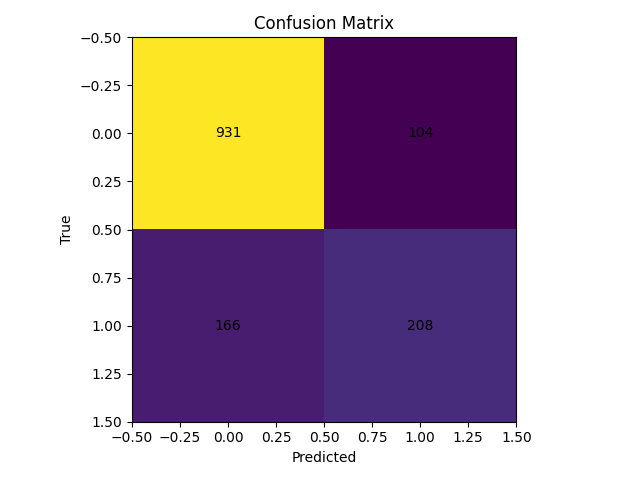

# Customer Churn Prediction


This is a learning project. I explored this dataset as part of a tableau dashboard project from analystbuilder.com (see below).
  
I also used AI assisted templates for code to review DevOps Concepts. I performed the planning of the project as if I were a project manager creating milestones, issues, PRs, actions, labels, code reviews, etc. It is an ongoing and I plan to expand it as I learn.

End-to-end churn workflow, built incrementally. As of **v0.5.0**, the project ships a **reproducible baseline model** CLI (Logistic Regression), artifact persistence, optional sampling, a Monte Carlo harness, and Docker UX fixes. Earlier versions provided Dockerized ETL + validation.

--- 

I have explored this dataset using Tableau in a project from analystbuilder.com

[Click here to view dashboard and exploratory data analysis project on Tableau](https://public.tableau.com/app/profile/jacob.breckenridge3515/viz/ChurnRateDashboard_17637009394140/Dashboard1?publish=yes)


---

## Stack Overview

```text
Developer (Make/Compose)
        |
        v
+-------------------+        +--------------------------+
|   app (Python)    | <----> |   db (PostgreSQL 16)     |
|  docker container |        |   docker container       |
+-------------------+        +--------------------------+
         ^   |
         |   |
         +----------------------------+ 
         |   reads env from `.env`    |
         | (POSTGRES_*; DATABASE_URL) |
         +----------------------------+
```

- **Python 3.11** (lean runtime): SQLAlchemy + psycopg v3, scikit-learn, pandas, matplotlib
- **PostgreSQL 16 (alpine)** with `pg_isready` healthcheck
- **Docker Compose** for orchestration
- **Makefile** for all workflows (build, load, train, validate, clean, etc.)
- **pre-commit + GitHub Actions** for formatting, linting, and notebook output stripping

---

## Quick Start (Docker + Make only)

```bash
# 1) Clone and configure env
git clone https://github.com/jbrdge/churn-prediction.git
cd churn-prediction
cp .env.example .env

# 2) Start the stack
make up

# 3) Verify configuration and DB connectivity
make health
```

**DB endpoints**
- Inside containers: `db:5432`
- From host (per compose mapping): `localhost:5433`

---

## Baseline Model (v0.5.0)

This release adds a reproducible Logistic Regression baseline trained on a Parquet features file.

### Build features parquet

Use the Kaggle **Telco Customer Churn** CSV to produce the features file:

```bash
# full dataset
make make-features-from-archive

# or a faster sampled parquet for smoke tests
make make-features-from-archive N=500
```

### Train and inspect

```bash
# Train baseline (Logistic Regression)
make train-baseline

# Inspect artifacts / metrics
make ls-artifacts
make show-metrics
```

Artifacts (under `artifacts/baseline_v1/`):
- `model.pkl` — serialized model
- `metrics.json` — accuracy, precision, recall, F1, ROC-AUC
- `params.json` — hyperparameters, seed, feature lists, sample_n
- `coefficients.csv` — model weights with one-hot expanded names
- `confusion_matrix.png`, `roc_curve.png`

### Sampling for speed

Cap training rows deterministically (before the split):

```bash
make train-baseline-sample N=100
```

### Monte Carlo (optional)

Stress-test stability by varying seed and (optionally) the sample size:


```bash
make monte-carlo N=50 MC_ITERS=10
make monte-carlo-summary
```

Pick and promote the **best** run’s artifacts by a chosen metric (default: `roc_auc`):

```bash
make mc-best
make mc-show-best           # pretty-print best_summary.json
make mc-show-best-metrics   # pretty-print metrics.json from best run
make mc-ls-best             # list files in best run folder
```

### Best-of Artifacts (tracked)

The following images and metrics are committed from the **best run** for reproducibility:

- 
- 
- [`metrics.json`](artifacts/mc_baseline/best/metrics.json)
- [`params.json`](artifacts/mc_baseline/best/params.json)
- [`coefficients.csv`](artifacts/mc_baseline/best/coefficients.csv)

---

## v0.4.0 — Validation Runbook

End-to-end validation workflow (from DB schema + CSVs → checks).

```bash
make e2e      # schema + load + validate
make e2e-v    # verbose variant (includes validate-all)
```

**What “good” looks like**
- Non-zero row counts in `customers` and `churn_labels`
- Orphaned labels = 0
- Churn snapshot on latest `label_date` shows true/false split

---

## Roadmap

- ✅ **[0.1.0] Stabilized Baseline** — cleanup, legacy notebook archived, changelog
- ✅ **[0.2.0] Repo Structure** — standardized Python/SQL layout, env templates
- ✅ **[0.3.0] Docker Compose** — Dockerfile + compose (Postgres), health checks, Make targets
- ✅ **[0.4.0] SQL ETL + Validation** — schema creation, CSV ingest CLI, validation runbook
- ✅ **[0.5.0] Baseline Model** — modeling CLI, artifacts & metrics, sampling, Monte Carlo
- ⏳ **[0.6.0] Tableau Dashboard** — publish dashboard; link from README

See details in [CHANGELOG.md](CHANGELOG.md).

---

## Notebooks Policy

- Notebooks are for **exploration**; production logic lives in `src/`.
- Outputs are stripped automatically (pre-commit `nbstripout`).
- Large or sensitive data should **not** be committed.

---

## Troubleshooting

**Port in use**
If `5433` is busy on the host, change the mapping in `docker-compose.yml`:
```yaml
db:
  ports:
    - "5434:5432"
```

**DB won’t become healthy**
```bash
make clean && make up
```

**Run quick sanity**
```bash
make db-ready
make db-psql
```

---

## License

MIT — see [LICENSE](LICENSE).
